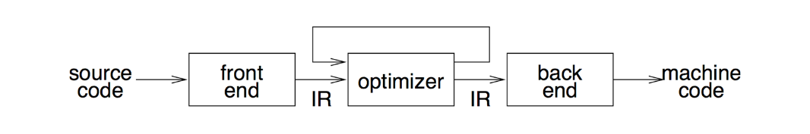
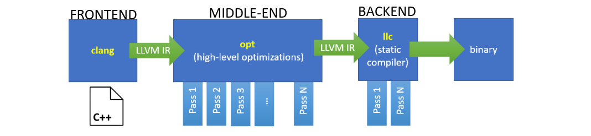

**Compilatore**
Strumento utilizzato per convertire il codice da un linguaggio all'altro. Fa parte di una toolchain dove l'obiettivo è generare dal sorgente un file eseguibile binario.
- L'altro compito è la **ottimizzazione** del codice.

**Esempi di Ottimizzazione**
Il loro scopo è quello di ridurre il numero di istruzioni e rimpiazzare operazioni costose. Possono essere combinate per produrre il codice perfetto.

``` C
// Algebraic Simplification (AS)
// Usa l'algebra per semplificare espressioni.

	- (-i) -> i
	b or (true) -> true

// Constant Folding (CF)
// Processa le espressioni costanti durante la compilazione.

	C = 1 + 3 -> C = 4
	(100 < 0) -> false

// Strength Reduction (SR)
// Cambia operazioni costose con operazioni meno costose.

	y = x * 2 -> y = x + x
	y = x * 17 -> y = (x << 4) + x

// Common Subexpression Elimination (CSE)
// Elimina calcoli ridondanti di espressioni usate più volte.

	y = b * c + 4
	z = b * c - 1
	
	x = b * c
	y = x + 4
	z = x - 1

// Dead Code Elimination (DCE)
// Rimuove codice non necessario.

	b = 3
	c = 1 + 3
	d = 3 + c
	
	c = 1 + 3
	d = 3 + c

// Copy Propagation (CP)
// Per x = y sostituisce gli usi futuri di x con y.

	x = y
	c = 1 + x
	d = y + c
	
	x = y
	c = 1 + y
	d = y + c
	
	c = 1 + y
	d = y + c

// Constant Propagation (CP)
// Sostituisce le variabili col loro valore costante.

	b = 3
	c = 1 + b
	d = b + c
	
	b = 3
	c = 1 + 3
	d = 3 + c
```

**Ottimizzazioni sui Loops**
Sono la parte del programma che richiedono più performance. Il target principale della ottimizzazione, si usa la Loop Invariant Code Motion (LICM).

``` C
// Sposta le istruzioni INDIPENDENTI dal loop fuori.

	while (i < 100)
	{
		*p = x / y + i
		i = i + 1
	}
	
	t = x / y;
	while (i < 100)
	{
		*p = t + i
		i = i + 1
	}
```

**Miglioramenti**
Per migliorare la performance di un compilatore si:
- Usa il parallelismo. I dati vengono eseguiti parallelamente su multipli threads.
- Minimizzano le cache miss.

**Anatomia del Compilatore**
Il compilatore svolge due compiti; l'analisi del codice sorgente e la sua traduzione in linguaggio macchina. Opera su una Rappresentazione Intermedia (IR).
- Grazie alla IR abbiamo una chiara distinzione tra front e back-end.



- Il blocco front-end produce la IR.
- Il blocco middle-end trasforma tramite dei **passi** la IR in una versione efficiente.
- Il blocco back-end trasforma la IR in linguaggio macchina.



**Flag di Ottimizzazione**
L'ottimizzatore LLVM (opt) è organizzato in una serie di passi. Si possono passare al pass manager dei flag che determinano il numero e l'ordine di passi.

- ***-g:*** Debugging.
- ***-O0:*** Nessuna ottimizzazione.
- ***-O1:*** Ottimizzazioni leggere come CP, CF, CSE...
- ***-O2:*** Ottimizzazioni pesanti.
- ***-Os:*** Ottimizzazioni per dimensione del compilato.

**Blocchi del Compilatore**
- Il blocco middle-end opera sulla IR ricevuta dal front-end e verrà poi presa in input dal back-end.
- Per supportare un nuovo linguaggio occorre creare un nuovo front-end, per supportare un nuovo target (ISA) occorre un nuovo back-end.