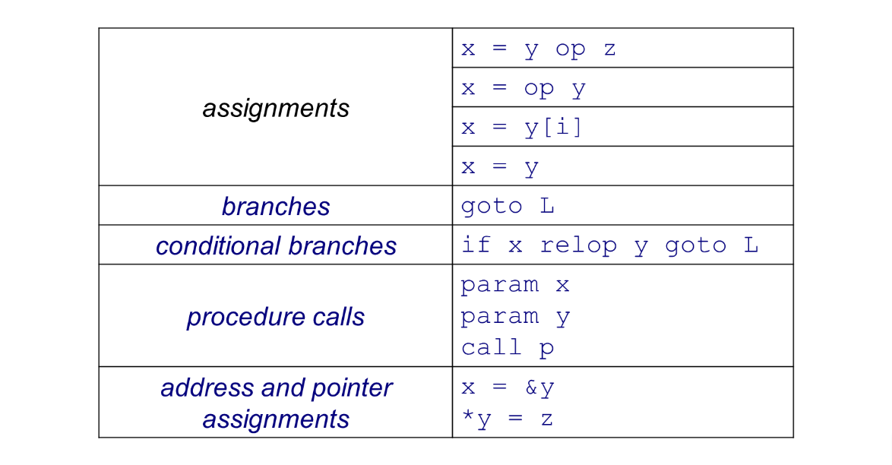
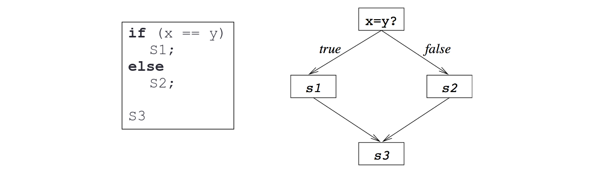
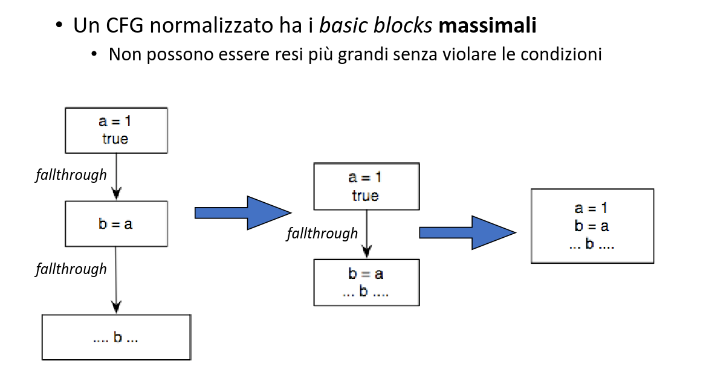

**Rappresentazione Intermedia**
È il codice intermedio utilizzato dal compilatore per analizzarlo e trasformarlo.
- Nel middle-end che è organizzato tramite **passi** la IR deve contenere tutte le informazioni necessarie da trasmettere da un passo all'altro.

**Tipi di IR**
- Abstract syntax trees, directed acyclic graphs, 3-address code, static single assignment, control flow graphs, call graphs, program dependence graphs...

**Categorie di IR**
- ***Grafiche:*** Sono le IR che sfruttano grafi, vengono utilizzati nel front-end e sono voluminose. Fanno trasformazioni *source-to-source,* quindi per esempio C -> C. Un vantaggio di queste IR è che gestiscono bene le grammatiche.
- ***Lineari:*** Rappresentano lo pseudo-codice di un ISA in modo astratto. Ci sono un numero massimo di operandi e un numero di registri illimitato. Vengono usate nel middle-end, usano strutture dati semplici e compatte, sono facili da riarrangiare.
- ***Ibride:*** Sfruttano entrambi i concetti.

**Sintassi Concreta**
È la maniera più semplice di rappresentare un programma, codice sorgente.
- ***Pro:*** Rappresentazione fedele di come un umano ragiona sul programma.
- ***Contro:*** Pessima per analizzare e trasformare il codice, troppo complesso. Abbiamo bisogno di un metodo che rappresenti solo la parte logica.

**Abstract Syntax Tree**
È un albero dove i nodi rappresentano parti del programma. Il nodo radice contiene il blocco di istruzioni del programma e abbiamo tanti figli quanto le istruzioni.
- ***Pro:*** Per analizzare l'albero basta una funzione ricorsiva. Ottimo nel front-end.
- ***Contro***: Abbiamo nodi di comportamenti diversi (registri, operandi...). Come IR non è la migliore. Dobbiamo ragionare costantemente su come gestire ogni nodo.

**Directed Acyclic Graph**
Estensione dell'AST che evita la duplicazione delle espressioni. Non ha cicli.
- ***Pro:*** Più compatto dell'AST.
- ***Contro:*** Possiamo riusare un'espressione solo se si dimostra che il valore non cambia nel tempo dato che il DAG non gestisce questa casistica. Chiamate ed assegnamenti sono molto frequenti, il DAG è utile quando questo non succede.

``` C
/* In questo caso il DAG non va bene, il valore di b + c è cambiato
prima di essere assegnato a c. */

a = b + c;
b = a - d; // Cambia qui; b diventa a - d.
c = b + c; 
d = a - d;
```

**Three Address Code**
Le istruzioni hanno forma `x = y op z` quindi un unico operatore e max 3 operandi.
- ***Pro:*** Espressioni complesse vengono spezzate in tante espressioni semplici. La forma è compatta e simile ad ASM, ci sono i temporanei che gestiscono i risultati intermedi e abbiamo registri virtuali illimitati.
- Nel middle-end non consideriamo le operazioni di spill (load/stores).

``` C
// Espressione
x - 2 * y;

// Rappresentazione 3AC
t1 = 2 * y;
t2 = x - t1;
```

**Codice 3AC**



**Rappresentazione 3AC**
L'espressione `x - 2 * y` in 3AC si può rappresentare in due modi:
- ***Triple:*** Vengono usati tre campi. L'indice dell'istruzione viene usato per indicare l'uso del registro stesso come registro sorgente o destinazione. Ottimizzato ma più complicato da gestire rispetto alla rappresentazione quadruple.
- ***Quadruple:*** Viene usato un array dinamico per rappresentare il numero di istruzioni, un simil-opcode per l'istruzione, il registro destinazione ed i due registri sorgente. Struttura semplice ma costa più nell'implementarla.

**Problema 3AC**
L'ottimizzazione CP non è immediata. Non abbiamo la certezza di sostituire il valore giusto se una costante viene ridefinita senza averla analizzata.

``` C
b = 3;
c = 1 + 3;
b = 4;
d = ? + 4;
```

**Static Single Assignment**
Evoluzione della 3AC. Ogni variabile è **definita** una singola volta.
- ***Esempio:*** Se abbiamo `b = 3` e la ridefiniamo a `b = 4` allora la variabile precedente viene distrutta e manteniamo solo l'ultima. CP è immediato.
- ***Pro:*** Abbiamo una definizione unica, l'analisi e la trasformazione del codice è semplificata, non dobbiamo fare analisi temporali sulle variabili.

``` C
b1 = 3;
c = 1 + 3;
b2 = 4;
d = 4 + 4;
```

**Scelta della IR**
Non esiste la IR perfetta, esistono varie IR adatte per determinati scopi.
- Tipicamente ne serve più di una. Si usano spesso forme ibride (CFG).

**Control Flow Graph**
IR che rappresenta il flusso di controllo del programma. È ibrida, quindi un grafo combinato alla forma lineare. Le IR precedenti non riescono a gestire il control flow.



**Basic Blocks**
La struttura dei nodi in CFG. Contengono una sequenza di istruzioni eseguita una dietro l'altra, viene terminato da un salto. Gli archi rappresentano il control flow.
- ***Esempio:*** In un `if` gli archi saranno due; uno `true` ed uno `false.`

**Definizione Formale BB**
È una sequenza di istruzioni in formato 3AC.
- Solo la prima istruzione è puntabile dall'esterno. Tutte le istruzioni del blocco sono eseguite se viene eseguita la prima. **Single entry, single exit.**
- Il basic block non può contenere label; si avrà un BB pre-label ed un BB che è la label stessa.



**Archi in CFG**
- **True/False (if).**
- **Fallthrough:** Un arco che connette due BB si dice fallthrough se la prima istruzione del secondo blocco è l'unica possibile successione al primo BB, non abbiamo quindi alcun salto. Letteralmente PC+4.

**Algoritmo Costruzione CFG**
1) Identificare il **leader** del BB. È la prima istruzione, il target di un salto oppure ogni istruzione che viene dopo un salto.
2) Il BB comincia con il leader e finisce all'ultima istruzione precedente al prossimo leader, oppure all'istruzione finale del programma.
3) BIsogna connettere i BB tramite archi fallthrough, true o false.

**Dependency Graph**
Il DG contiene le istruzioni che usano valori e ne definiscono un altro. Gli archi del DG collegano due nodi dove uno usa il risultato dell'altro.
- Indispensabile per **l'instruction scheduling.** Il DG memorizza le dipendenze tra le varie istruzioni in modo da ottimizzare l'ordinamento. Il compilatore deve usare la istruzione giusta (riordinamento) per massimizzare l'efficienza ed evitare **data hazards**.

**Data Dependency Graph**
DG che rappresenta le dipendenze su dati. I loops innestati sono buoni per il parallelismo a patto che non ci siano loop carried dependencies.
- ***Loop Carried Dependence:*** Dipedenze verificate nei loops.

``` C
// Loop Carried Dependence

A[i] = A[i-1]; 

// NON parallelizzabile, il risultato dipende dalla iterazione prec.
// se parallelizziamo potremmo non aver le iterazioni necessarie già
// eseguite.

A[i-1] = A[i];

// Parallelizzabile, ogni iterazione è indipendente, non si va a mod.
// un valore che viene usato subito dopo.
```

**Call Graph**
Mostra l'insieme delle chiamate tra funzioni gerarchicamente.
- Le analisi delle varie chiamate possono essere fatte in modo intraprocedurale, interprocedurale oppure si può analizzare il programma intero.
