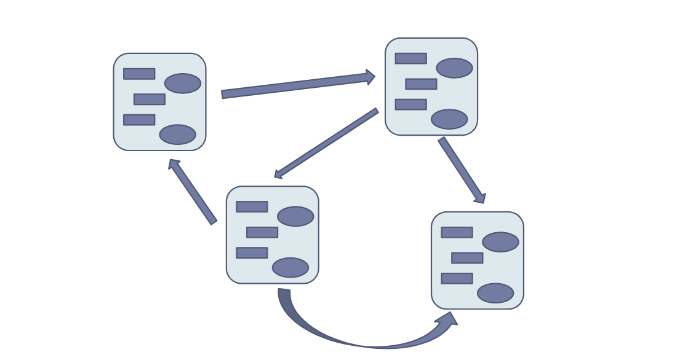

**Esempio OOP**
Abbiamo bisogno di un paradigma di programmazione che offre:
- Astrazione e protezione sui dati, riutilizzo del codice attraverso entità che comprendono dati e codice.

``` Java
ADTdef Contatore
{
	// Attributi.
	
	int val;
	
	// Operazioni.
	
	void setVal(int newVal) {val = newVal;}
	void inc() {val++;}
	int getVal() {return val;}
}
```

``` Java
ADTdef Main
{
	main()
	{
		Contatore cont;  // Istanzio contatore 1.
		Contatore cont2; // Istanzio contatore 2.
		
		cont.setVal(0);  // Setto contatore 1.
		cont2.setVal(0); // Setto contatore 2.
		
		cont.inc();      // Aumento valore del contatore 1 di 1.
		cont2.inc();     // Aumento valore del contatore 2 di 1.
		
		/* Non vado a toccare il valore del primo contatore con il
		   secondo incremento. */
	}
}
```

- Non possiamo fare operazioni errate. Per esempio `cont++` è illegale. Al contrario di C non usiamo un `int` ma un tipo dedicato per creare l'entità.
- `cont.val++` è illegale. Possiamo agire solo con i metodi.
- Se non vogliamo `cont.setVal(-1)` allora basta impostare un controllo.



**Protezione dei Dati**
- Con la protezione dei dati possiamo agire sugli attributi solo con i metodi.
- Il controllo è hard-coded nella operazione dell'entità. È facile da ripescare e da modificare.

**Oggetto**
Nell'esempio precedente `cont` e `cont2` sono oggetti.
- Sono entità che incapsulano dati e codice.

**Stato**
Contiene le informazioni sullo stato dell'oggetto. È nascosto all'esterno.
- Composto da variabili oppure oggetti.

**Interfaccia**
Contiene le informazioni sulle operazioni dell'oggetto.
- Composto dai metodi. Servono per agire sullo stato.

**Classificazione**
Certi oggetti possono essere diversi ma avere la stessa struttura, quindi lo stesso stato e la stessa interfaccia.

**Classe**
Descrive la struttura comune a tutti gli oggetti di un certo tipo. È un ADT.
- Vengono derivati oggetti che sono istanze di classe.

**Classi ed Oggetti**
- Le classi sono definite **staticamente** dal programmatore mentre gli oggetti sono creati **dinamicamente** a runtime.
- In un modello client-server gli oggetti mettono a disposizione servizi. Ogni metodo è considerabile come un servizio.
- C'è una forte dipendenza tra classe ed una sua istanza che dura per tutta la sua vita. L'istanza trova il codice da eseguire nella classe.

**Modello Client-Server**
- ***Client:*** Richiede il servizio e **deve** conoscere il server.
- ***Server:*** Mette a disposizione il servizio e non conosce il client.

Non viene chiamata una funzione che agisce su un'entità ma è l'entità stessa che svolge un servizio.
- I client non conosco i dettagli implementativi del server, non possono accederci. C'è una indipendenza tra client e server.

``` Java
// Programmazione Procedurale
insert(List, e);

// Programmazione ad Oggetti
List.insert(e);
```

**Filosofia OO**
Un'applicazione è una serie di oggetti che interagisce tra loro. L'interazione tra gli oggetti avviene tramite metodi. Si ha un rapporto client-server **tra oggetti.**
