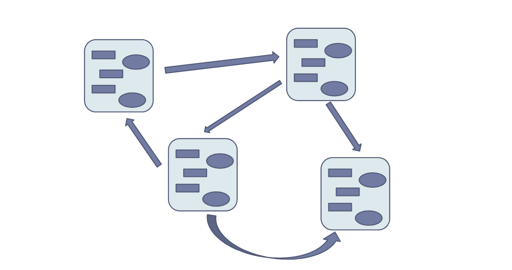

**Scenario**
Con la programmazione funzionale e modulare non si è in grado di creare software complessi. Si ha bisogno di un nuovo paradigma di programmazione.
- ***Esempio:*** Impossibile proteggere tutte le funzionalità, complicato riusare il programma, non buona per software grandi, difficile il mantenimento `(C).`

**Software Ideale**
- ***Protetto:*** Parti di programma possono influire solo su certe funzionalità.
- ***Riusabile:*** Non riscrivere codice già scritto.
- ***Documentato:*** Capire cosa fa il codice scritto.
- ***Modulare:*** Dividere il software e gestire le funzionalità separatamente.
- ***Estendibile:*** Aggiungere ciò che manca al codice già scritto.

**OOP**
Per gestire la complessità dei software è necessario un nuovo paradigma che:
- ***Progetto:*** Divide il software in **entità** ben definite.
- ***Implementazione:*** Identifica le funzioni che agiscono su determinati dati e li protegge dalle altre funzioni.



**Astrazione di Dato**
È un entità astratta che è definita da:
- ***Attributi:*** I dati che specificano lo stato dell'entità. **NON** sono accessibili dall'esterno.
- ***Operazioni:*** Le funzionalità che offre l'entità. **SONO** accessibili dall'esterno, possono accedere agli attributi dell'entità stessa.

1) Viene agevolata la modularità del software. Accoppiamo dati e funzioni quindi è facile separare tutto in più file.
2) Viene favorito il controllo dei dati. Abbiamo relativamente poche funzioni che possono agire sui dati.

**Abstract Data Type**
È il tipo che deriva dalla nostra astrazione di dato.
- Grazie all'ADT possiamo istanziare oggetti di tipo `entità.`

**Astrazioni di Dato - C**
- Abbiamo bisogno di scomporre il software in entità e proteggere dati.

**Scomposizione Software**
In C possiamo dividere il software in più file che rappresentano moduli o entità.
- Approccio molto vantaggioso sia a livello di struttura sia a livello di compilazione.

**Protezione dei Dati**
In C si possono sfruttare le classi di memorizzazione.
- Ogni entità è caratterizzata dal nome, tipo, valore, indirizzo, tempo vita e scope.

**Classi di Memorizzazione**
Gestiscono il tempo di vita e lo scope di una variabile/funzione. Indica il tipo dell'area di memoria in cui una entità viene memorizzata. Sono quattro:
- ***Auto:*** Scope locale al blocco. Tempo di vita temporaneo (uguale a ***Register***).
- ***Static:*** Scope locale al blocco/globale al file. Tempo di vita permanente.
- ***Extern:*** Scope globale al programma. Tempo di vita permanente.

**Note**
1) In C tempo di vita e scope sono indipendenti, non è sempre così.
2) Se si parla di scope si parla di **dichiarazione** (specifica tipo/prototipo) mentre se si parla di tempo di vita si parla di **definizione** (allocazione memoria).

**Protezione dei Dati - Applicazione**
Sfruttiamo il fatto che le variabili statiche sono visibili solo nel file corrente. Solo le funzioni di quel file potranno agire sulle variabili.

``` C
// count.h - Astrazione di Dato

int getVal(void);
void setVal(int);
void inc(void);
```

``` C
// count.c - Astrazione di Dato

include "count.h"

static int Contatore = 0;

int getVal(void) {return Contatore;}
void setVal(int c) {Contatore = v;}
void inc(void) {Contatore++;}
```

``` C
// main.c - Astrazione di Dato

include "count.h"

void main()
{
	setVal(10);
	inc();
	printf("Valore = %d\n", getVal());
}
```

- Il contatore è inaccessibile dall'esterno. Non è necessario passare puntatori per fare in modo che funzioni. Il problema essenziale è che ho solo una istanza di contatore disponibile. Non è una soluzione corretta.

``` C
// count.h - ADT

typedef int Contatore;

int getVal(Contatore c);
void setVal(Contatore* c, int v);
void inc(Contatore* c);
```

``` C
// count.c - ADT

include "count.h"

int getVal(Contatore c) {return c;}
void setVal(Contatore* c, int v) {*c = v;}
void inc(Contatore *c) {(*c)++;}
```

``` C
// main.c - ADT

include "count.h"

void main()
{
	Contatore c1, c2;
	setVal(&c1, 10)
	setVal(&c2, -31);
	
	printf("Valore di c1 = %d", getVal(c1));
	inc(&c2);
}
```

- Possiamo usare più istanze dello stesso oggetto però è un approccio meno sicuro (puntatori, rischio di non inizializzare oggetti), inoltre c'è la possibilità di fare operazioni non ammesse`(es. c1 *= c2 o c1--).`
- Potremmo dover estendere il codice ulteriormente. È rischioso data la struttura ed i difetti di entrambi gli approcci. D'ora in poi si userà la OOP.
