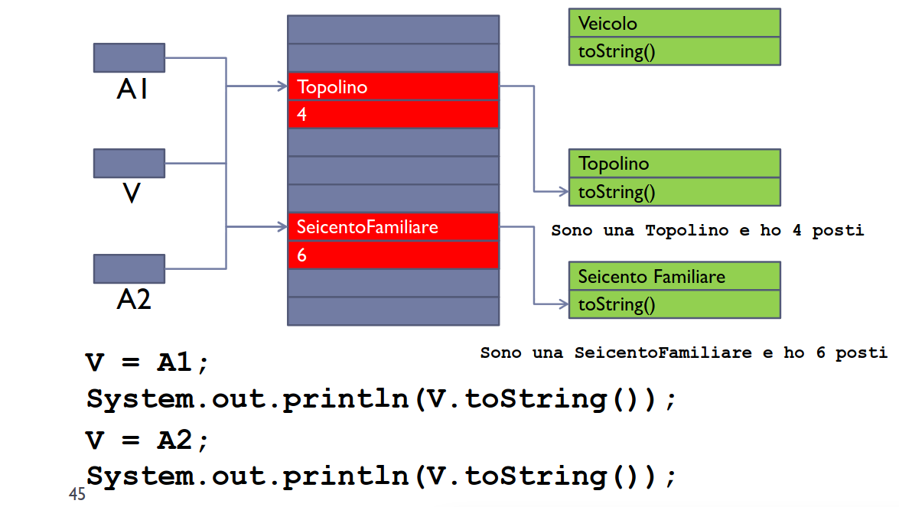

**Incapsulamento**
La classe incapsula variabili, metodi e, volendo, altre classi. Nasconde i dettagli implementativi al mondo esterno.
- I metodi vanno definiti all'interno della classe che li dichiara.

``` Java
public class Veicolo
{
	private int velocitàMassima;
	private int numeroPosti;
	
	public Veicolo(int VM, int NP)
	{
		velocitàMassima = VM;
		numeroPosti = NP;
	}
	
	public int getVelocitàMassima()
	{
		return velocitàMassima;
	}
	
	public int getNumeroPosti()
	{
		return numeroPosti;
	}
}
```

``` Java
public class Esempio2
{
	public static void main(String args[])
	{
		Veicolo miaMacchina;
		miaMacchina = new Veicolo(150, 5);
		
		System.out.print("La mia macchina ha ");
		System.out.print(miaMacchina.getNumeroPosti() + "posti ");
		System.out.print("e raggiunge la velocità di ");
		System.out.println(miaMacchina.getVelocitàMassima() + "km/h.");
	}
}

/* int intero = miaMacchina.numeroPosti avrebbe dato errore di
   compilazione, non accediamo allo stato esternamente. */

/* $ java Esempio2
   Output: La mia macchina ha 5 posti e raggiunge la velocità di
   150 km/h. */
```

**Visibilità**
Le variabili ed i metodi possono avere uno dei seguenti attributi di visibilità:
- ***Public:*** Visibile da tutti.
- ***Private:*** Non visibile dall'esterno.
- ***Protected:*** Visibile solo dalle classi figlie e dalle classi contenute nello stesso package (visibilità **friendly** solo dalle classi del package).

**Ereditarietà**
È una caratteristica della OOP che permette di definire nuove classi partendo da classi già esistenti. È utile per creare classi simili ma con funzionalità aggiuntive.

``` Java
class Contatore2 extends Contatore
{
	public void dec()
	{
		setVal(getVal() - 1);
	}
}

/* Contatore2 estende Contatore ed aggiunge il metodo decremento.
   Dobbiamo usare getters e setters per poter accedere agli attributi
   del padre. */
```

**Relazione tra Classi**
L'ereditarietà introduce una relazione tra classi.
- Classe Padre -> Classe Figlia.

**Ereditarietà in Java**
- ***Ereditarietà Singola:*** Si usa la keyword `extends.` La sottoclasse ottiene tutti gli attributi ed i metodi della superclasse - può ridefinire solo metodi/attributi visibili.
- ***Ereditarietà Monotona:*** Possono essere solo aggiunti membri, non rimossi.

**Ereditarietà - Costruttori**
La sottoclasse NON eredita i costruttori dal padre dato che servono per inizializzare lo stato di una determinata classe.
- Se non c'è un costruttore nella sottoclasse allora il compilatore ne aggiunge uno senza parametri che chiama il costruttore senza parametri del padre.
- Se non c'è il costruttore senza parametri nella superclasse si verifica un errore.

**Ereditarietà - Super**
- Keyword `super` viene usata per fare riferimento a metodi, variabili o costruttori della superclasse.

``` Java
class ContatorePreciso extends Contatore
{
	private double val;
	
	/* val indica val di ContatorePreciso
	   super.val indica val di Contatore. */
	
	@Override
	public void inc()
	{
		super.inc();
		val++;
	}
	
	/* inc() indica il metodo di ContatorePreciso
	   super.inc() chiama il costruttore di Contatore. */
}
```

- Ridefinire variabili non è utile mentre ridefinire metodi è essenziale per aver un comportamento polimorfico. `super` permette di richiamare il metodo padre per riutilizzare il codice.

**Gerarchia Classi Java**
La classe `Object` è la classe che raggruppa tutte le definizioni comuni ad ogni oggetto. Essa fa da superclasse per ogni singola classe, tutte derivano da essa.

``` Java
public class Veicolo // extends Object
{
	private int numeroPosti;
	
	public Veicolo (int NP)
	{
		numeroPosti = NP;
	}
	
	public int getNumeroPosti()
	{
		return numeroPosti;
	}
}
```

``` Java
public class VeicoloTerrestre extends Veicolo
{
	private int numeroRuote
	
	public VeicoloTerrestre(int NP, int NR)
	{
		super(NP);
		numeroRuote = NR;
	}
	
	public int getNumeroRuote()
	{
		return numeroRuote;
	}
}
```

``` Java
public class VeicoloAcquatico extends Veicolo
{
	private long stazza;
	
	public VeicoloAcquatico(int NP, long S)
	{
		super(NP);
		stazza = S;
	}
	
	public long getStazza()
	{
		return stazza;
	}
}
```

``` Java
public class Esempio3
{
	public static void main(String args[])
	{
		VeicoloTerrestre miaMacchina;
		VeicoloAcquatico miaNave;
		
		miaMacchina = new VeicoloTerrestre(5, 4);
		miaNave = new VeicoloAcquatico(10, 10);
		
		System.out.print("La mia macchina ha ");
		System.out.print(miaMacchina.getNumeroPosti() + "posti e ");
		System.out.println(miaMacchina.getNumeroRuote() + "ruote.");
		
		System.out.print("La mia nave ha ");
		System.out.print(miaNave.getNumeroPosti() + "posti e ");
		System.out.println("una stazza di " + miaNave.getStazza());
	}
}

/* $ java Esempio 3
   La mia macchina ha 5 posti e 4 ruote.
   La mia nave ha 10 posti e una stazza di 10. */ 
```

**Regola di Conformità**
Un `Contatore2` ha tutte le caratteristiche di un `Contatore` normale, difatti la superclasse viene estesa. `Contatore = Contatore2` ma non vale il contrario.
- Comportamento polimorfico.

**Polimorfismo**
Il polimorfismo consiste nel cambio di comportamento di un oggetto a seconda del suo tipo. Nell'esempio abbiamo che il metodo `toString()` cambia comportamento sia quando `V` è `Topolino` sia quando `V` è `SeicentoFamiliare.`
- In Java si basa su **binding dinamico** e **overriding.**
- Il polimorfismo separa il controllo dal comportamento. Il controllo è gestito da chi chiama il metodo polimorfico, il comportamento dal metodo stesso.

``` Java
public class Veicolo
{
	private int numeroPosti;
	
	public Veicolo(int NP)
	{
		numeroPosti = NP;
	}
	
	public int getNumeroPosti()
	{
		return numeroPosti;
	}
	
	public String toString()
	{
		return "Veicolo con " + numeroPosti + "posti.";
	}
}
```

``` Java
public class Topolino extends Veicolo
{
	public Topolino(int NP)
	{
		super(NP);
	}
	
	@Override
	public String toString()
	{
		return "Sono una Topolino e ho " + getNumeroPosti() + "posti.";
	}
}
```

``` Java
public class SeicentoFamiliare extends Veicolo
{
	public SeicentoFamiliare(int NP)
	{
		super(NP);
	}
	
	@Override
	public String toString()
	{
		return "Sono una Seicento Familiare e ho " + getNumeroPosti() +
		       "posti.";
	}
}
```

``` Java
public class Esempio4
{
	public static void main(String args[])
	{
		Veicolo V;
		Topolino A1 = new Topolino(4);
		SeicentoFamiliare A2 = new SeicentoFamiliare(6);
		
		V = A1; // Binding Dinamico + Regola Conformità
		System.out.println(V.toString());
		V = A2; // Binding Dinamico + Regola Conformità
		System.out.println(V.toString());
	}
}

/* java Esempio4
   Sono una Topolino e ho 4 posti
   Sono una SeicentoFamiliare e ho 6 posti */
```



