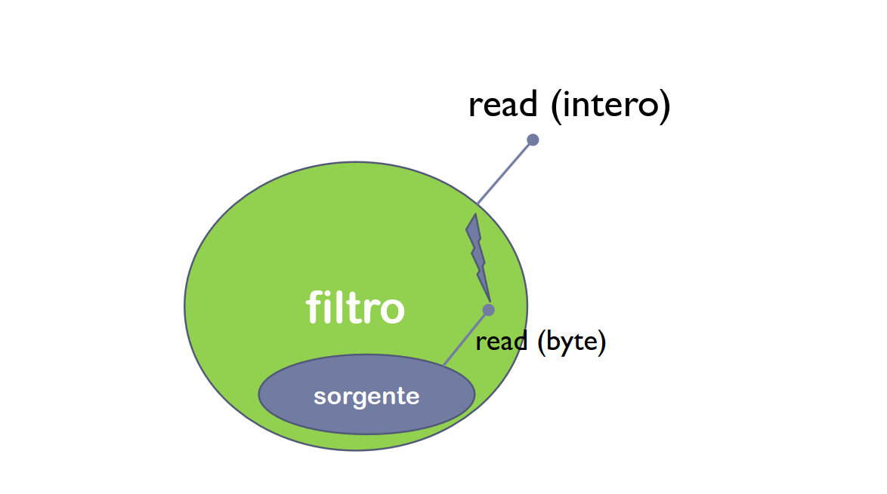

## Gestione Errori Java

**Eccezione**
Evento che avviene durante l'esecuzione del programma e cambia ciò che dovrebbe essere il normale comportamento.
- In Java la gestione degli errori viene attraverso eccezioni.

**Gestione Errori - C**
Si usano i costrutti condizionali (`if, switch...`)
- ***Esempio:*** La funzione `open()` in `C` restituisce un valore se non è riuscita ad aprire un file. Sfruttiamo questo valore per gestire i casi con un `if/switch.`
- Questo metodo non è ottimale: se la funzione può restituire un intero non predefinito non possiamo gestire i casi quindi non sappiamo che condizione mettere. Inoltre avere un `if` per ogni casistica complica il codice.

**Gestione Errori - Java**
Java usa un approccio OOP. Esistono classi per rappresentare eccezioni. La classe radice delle eccezioni è la classe `Throwable` che ha due sottoclassi.
- ***Error:*** Definisce errori interni non recuperabili (memoria, per esempio).
- ***Exception:*** Definisce errori recuperabili (file non trovato).

> I vantaggi di questo approccio sono avere entità ben definite che rappresentano eccezioni e che queste eccezioni sono oggetti. Hanno variabili/metodi utili per capire cosa sia successo.

**Gestione Errori - Segnalazione**
- `throw:` Solleva un eccezione.
- `throws:` Indica le eccezioni che un metodo può sollevare.

**Catturare un'Eccezione**
Una eccezione sollevata (segnalata) viene catturata e gestita attraverso il costrutto `try-catch.`

***Esempio:*** Il metodo `read()` può sollevare una `IOException` se non riesce a leggere da file. Per gestirlo dobbiamo usare il `try-catch.`
- Possiamo avere più blocchi catch se dobbiamo gestire più eccezioni.

``` Java
try
{
	// Blocco di istruzioni a rischio di eccezione
	c = f.read();
}
catch (IOException e) // <- Tipo di eccezione da catturare + nome var.
{
	// Istruzioni da eseguire in caso di eccezione
	System.err.println("Impossibile leggere: " + e);
}
```

> In questo modo non dobbiamo usare il valore di ritorno di un metodo per gestire una eccezione. Possiamo anche usare lo stesso try per più istruzioni in casi estremi.

**Rilancio Eccezione**
Se un metodo invoca un altro metodo a rischio può non gestire direttamente l'eccezione ma rilanciarla a chi invocherà il metodo a rischio.
- `M()` scarica la gestione al chiamante. La chiamata di `M()` deve avvenire all'interno di un `try-catch.`

``` Java
public int M() throws IOException
{
	c = f.read();
}
```

``` Java
public void useM()
{
	try
	{
		c = M();
	}
	catch (IOException e)
	{
		System.err.println("Impossibile leggere: " + e);
	}
}
```

**Eccezioni Da Non Catturare**
In Java tutte le eccezioni vanno catturate. Ci sono però alcune eccezioni che non è necessario catturare come le `RuntimeException` e le sue sottoclassi.
- `ArrayIndexOutOfBounds.`

## Intro I/O in Java

**Package I/O**
Questo package definisce quattro classi astratte che derivano da `Object:`
- ***Input/OutputStream:*** Legge/scrive stream di **byte** (non caratteri).
- ***Reader/Writer:*** Legge/scrive stream di **caratteri**.

**Byte vs Char - Java**
In Java sono tipi diversi, quindi è necessario distinguerli nell'I/O. Un `char` in Java corrisponde a 2 byte, non 1 come per esempio `C.`

**Gerarchia I/O - Classi Astratte**
Le quattro classi astratte principali forniscono metodi generici per leggere e scrivere su flussi **non strutturati** di dati - quindi byte e char.

**Gerarchia I/O - Classi Derivate**
Dalle classi astratte nascono classi derivate concrete che leggono e scrivono tipi specifici di stream. Avremo due tipi di sottoclassi.
- Classi **sorgente e pozzo.**
- Classi **filtro.**

**Gerarchia I/O - Classi Sorgente e Pozzo**
Classi derivate che specificano la sorgente e la destinazione dei flussi. Non aggiungono altre funzionalità.
- Per l'input il flusso può diventare un file o un buffer.
- Per l'output il flusso può diventare un file o un buffer.

**Gerarchia I/O - Classi Filtro**
Classi derivate che aumentano le funzionalità delle classi astratte in modo da poter scrivere su flussi strutturati di dati. Non si preoccupano della sorgente/destinazione.
- Con le classi filtro possiamo leggere/scrivere su tipi di dato o su oggetti interi.
- Esistono classi che specializzano altre classi filtro. `LineNumberReader` esempio restituisce come output le linee in input ma numerate.

**I/O - Java**
Per usare l'I/O in Java usiamo l'incapsulamento. Consiste nella composizione di oggetti fino ad avere tutti gli oggetti che coprono le funzionalità richieste.
- Per incapsulamento non si intende l'incapsulamento della OOP!

**Incapsulamento - Metodo**
1) Si crea un oggetto da una classe sorgente per definire il flusso di dati.
2) Si crea un oggetto da una classe filtro. Si passa al costruttore l'oggetto sorgente - lo incapsuliamo.
3) Volendo si possono incapsulare classi filtro in altre classi filtro in modo da ottenere tutte le funzionalità previste.



``` Java
import java.io.*;

public class InputOutput
{
	public static void main(String args[])
	{
		/* Creiamo uno stream di input associato ad un file tramite
	       la classe sorgente. */
	    
		FileInputStream f = null;
		f = new FileInputStream("Prova.dat");
		
		/* Lo incapsuliamo all'interno della classe filtro che gli
		   da le funzionalità per poter leggere i tipi primitivi. */
		
		DataInputStream is = new DataInputStream(f);
	}
}
```

## I/O Binario

**Metodi - InputStream**
- `read():` Legge bytes.
- `available():` Ritorna il numero di byte disponibili in input.
- `skip():` Salta `n` byte.
- `mark():` Marca la posizione corrente sullo stream.
- `reset():` Torna alla posizione marcata.
- `markSupported():` Dice se lo stream può essere marcato.

**Metodi - OutputStream**
- `write():` Scrive bytes.
- `flush():` Svuota il buffer di scrittura.
- `close():` Chiude lo stream

**Apertura Stream**
In Java lo stream viene aperto quando viene istanziato l'oggetto.

**Lettura Stream**
Avviene tramite il metodo `read().`
- Restituisce un numero `0 <= n <= 255` se la lettura è andata a buon fine altrimenti `-1` che indica lo stream finito.

``` Java
public class Read
{
	public static void main(String args[])
	{
		int i;
		byte b;
		i = System.in.read(); // Leggo byte, ritorno integer.
		
		/* Lettura byte per byte. Estrapolo ogni byte dal mio
		   flusso di dati. */
		
		if (i != -1)
			b = (byte) i;
	}
}
```

**Fine Stream**
Lo rileviamo checkando il valore di ritorno di `read()` - se raggiungiamo `-1` siamo nell'EOF quindi non abbiamo più byte da leggere.

## Serializzazione

**Serializzazione**
È la trasformazione a partire da un oggetto ad uno stream di byte salvabile su file. Analogamente **deserializzare** significa ricostruire un oggetto dallo stream di byte.
- Una classe serializzabile deve implementare il marcatore `Serializable.`

**Serializzazione - Classi**
- ***Serializzazione:*** `ObjectOutputStream.`
- ***Deserializzazione:*** `ObjectInputStream.`

**Serializzazione - Metodi**
- `writeObject():` Serializza l'oggetto. Scrive tutti i dati compresi i campi privati e quelli ereditati dalla superclasse.
- `readObject():` Deserializza l'oggetto. Legge tutti i dati come `writeObject().`

**Serializzazione - Ricorsione**
Anche i riferimenti ad oggetti vengono serializzati. `writeObject()` viene invocata ricorsivamente sugli oggetti referenziati. Serializzare un oggetto può comportare la serializzazione di un **grafo di oggetti**.
- Se un oggetto è referenziato più volte verrà serializzato una sola volta per evitare cicli infiniti. L'opposto di tutto avviene nella deserializzazione.

``` Java
import java.io.*:

class List implements Serializable // Interfaccia Serializable
{
	private Object e;
	private List next;
	
	public List()
	{
		e = null;
		next = null;
	}
	
	public Object head()
	{
		return e;
	}
	
	public List tail()
	{
		return next;
	}
	
	public List cons(Object e)
	{
		List nl = new List();
		nl.e = e;
		nl.next = this;
		return nl;	
	}
}
```

``` Java
import java.io.*;

public class Prova1
{
	static List makeList()
	{
		List l = new List();
		l = l.cons(new Integer(5));
		l = l.cons(new String("Ciao"));
		return l;
	}
	
	public static void main(String args[])
	{
		// Serializzazione
		FileOutputStream f = null;
		
		try
		{
			f = new FileOutputStream("Prova.dat");
		}
		catch (IOException e)
		{
			System.exit(1);
		}
		
		ObjectOutputStream os = null;
		List l = makeList();
		System.out.print("Scrittura su file...");
		
		try
		{
			os = new ObjectOutputStream(f);
			os.writeObject(l);
			os.flush();
			os.close();
		}
		catch (IOException e)
		{
			System.exit(2);
		}
		
		System.out.println("Ok.");
		System.out.println("Rilettura da file: ");
		
		// Deserializzazione
		FileInputStream fin = null;
		ObjectInputStream is = null;
		
		try
		{
			fin = new FileInputStream("Prova.dat");
			is = new ObjectInputStream(fin);
		}
		catch (IOException e)
		{
			System.exit(3);
		}
		
		List x = null;
		
		try
		{
			x = (List)(is.readObject()); // Specificare tipo var.
			is.close();
		}
		catch (IOException e)
		{
			System.exit(4);
		}
		catch (ClassNotFoundException e)
		{
			System.exit(5);
		}
		
		List xx = x;
		
		while (xx != null)
		{
			System.out.println(xx.head());
			xx = xx.tail();
		}
	}
}
```

**Campi Transienti**
A volte non tutti i campi di un oggetto devono essere serializzati. Per distinguere i campi da serializzabili a non bisogna usare la keyword `transistent.`
- Per esempio la posizione del cursore del mouse, verrà riposizionato sempre.

**Versione Classe**
La versione serializzata di un oggetto contiene un numero di versione. Quando deserializziamo una classe questo numero viene controllato.
- Se non coincide con la versione della classe attuale verrà lanciata un eccezione.

## I/O Caratteri

**Note**
- Vale l'incapsulamento come per l'I/O binario.
- I metodi sono analoghi rispetto a quelli degli stream di byte.
- Lo stream viene aperto quando l'oggetto viene istanziato.

**Lettura Stream**
Avviene attraverso il metodo `read().`
- Restituisce un numero `0 <= n <= 65535` se la lettura è andata a buon fine altrimenti `-1` che indica lo stream finito.

``` Java
public class Read
{
	public static void main(String args[])
	{
		int i;
		char c;
		i = System.in.read(); // Leggo byte, ritorno integer.
		
		/* Lettura char per char. Estrapolo ogni char dal mio
		   flusso di dati. */
		
		if (i != -1)
			c = (char) i;
	}
}
```

**Fine Stream**
- Lo rileviamo checkando il valore di ritorno di `read()` - se raggiungiamo `-1` siamo nell'EOF quindi non abbiamo più byte da leggere.
- Usiamo il metodo `ready()` che controlla quanti caratteri abbiamo da leggere. Restituisce `true` in caso positivo. Non funziona con tutti gli stream di caratteri.
