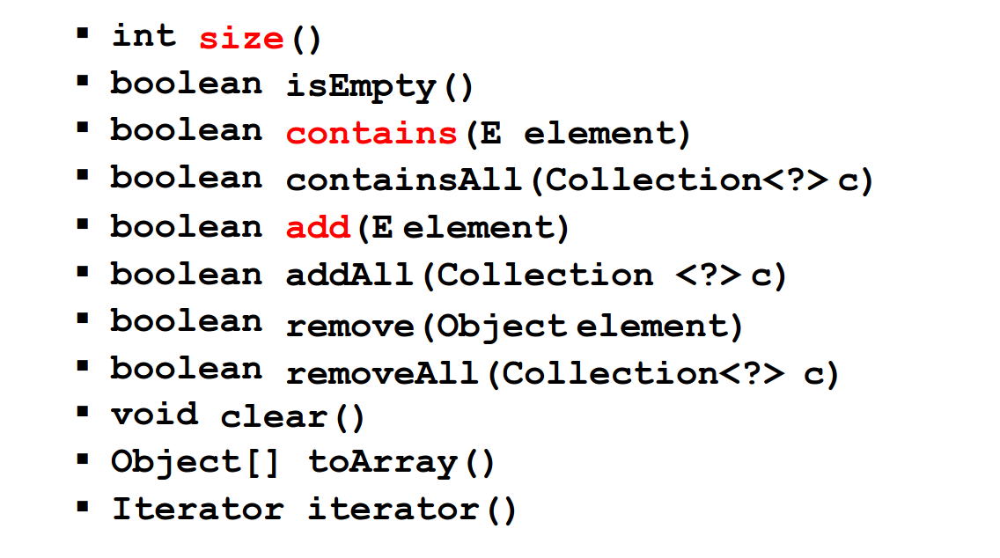
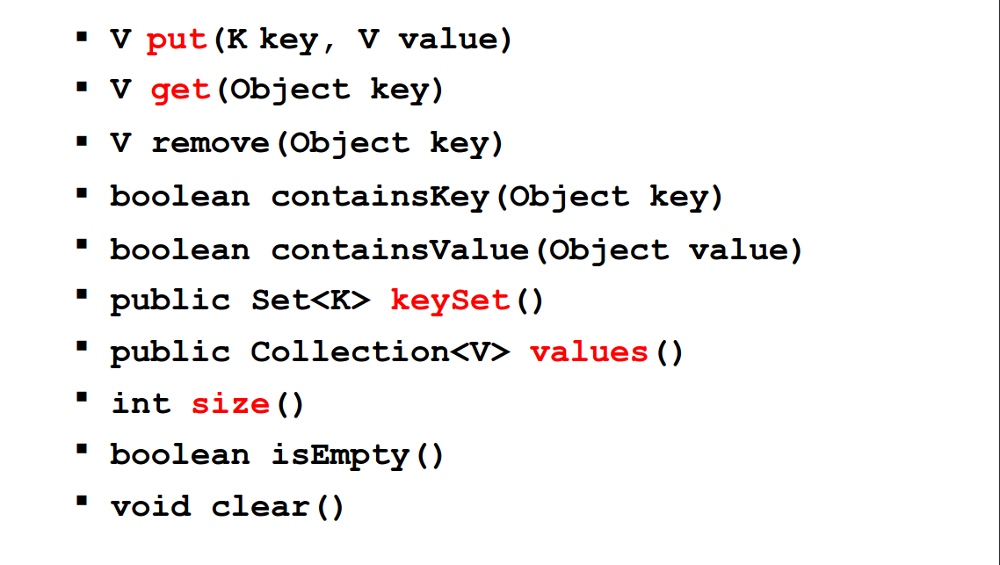
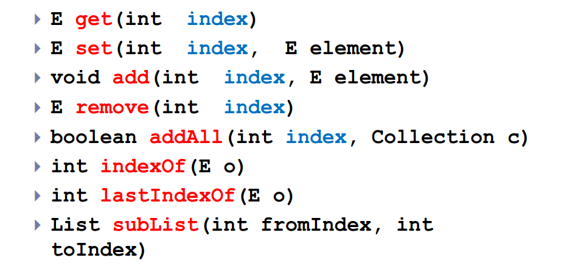
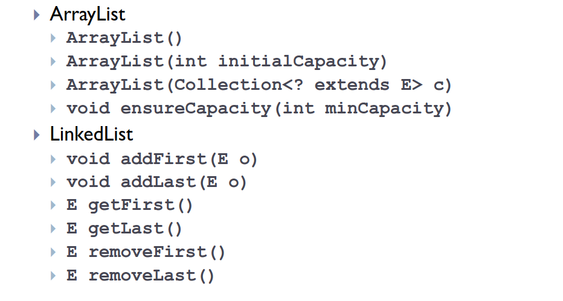
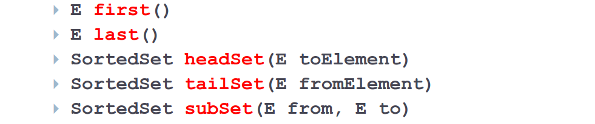
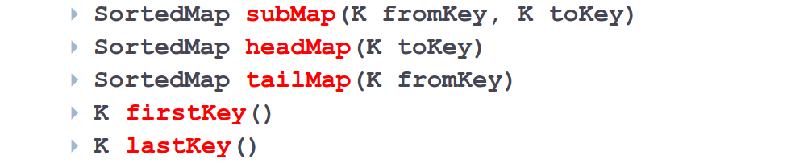

**Strutture Dati - Java**
Java implementa le strutture dati usando un mix di interfacce e classi.
- Le interfacce definiscono il tipo della struttura dati mentre le classi contengono le implementazioni delle strutture dati specifiche. Si trovano nel package `java.util.`
- Le strutture dati sono definite come generics.

**Interfacce - Collection**
`Collection<E>` è una interfaccia che definisce strutture dati di oggetti senza **specificare l'ordine** o se sono presenti dei **duplicati.**
- Abbiamo almeno due costruttori base: quello senza parametri e quello con parametro la struttura dati utilizzata.



**Interfacce - Map**
`Map<K, V>` è una interfaccia che definisce strutture dati che associano chiavi a valori.
- Chiavi e valori sono **oggetti.** Le chiavi devono essere **uniche** e verranno associate ad un solo valore. Anche le strutture dati derivanti da Map hanno almeno due costruttori base.



``` Java
// Associazione CF -> Persona usando una Hash Map.

Map<String, Person> people = new HashMap<String, Person>();

people.put("ALCSMT", new Person("Alice", "Smith"));
people.put("RBTGRN", new Person("Robert", "Green"));

Person bob = people.get("RBTGRN");

if (bob == null)
	System.out.println("Not found!");

int populationSize = people.size();
```

**Collection - List**
`List<E>` contiene una sequenza di elementi (anche duplicati). L'ordine di inserimento è mantenuto, possiamo accedere agli elementi tramite l'index.
- Aggiunge funzionalità rispetto all'interfaccia `Collection.`



**List - Implementazioni**
- `ArrayList:` Basata su un array dinamico. `get(index)` è costante, inserimento e cancellazione di un elemento sono lineari.
- `LinkedList:` Basata su puntatori. `get(index)` è lineare, inserimento e cancellazione di un elemento sono costanti.

`Costruttori + Metodi`



``` Java
List<Integer> al = new ArrayList<Integer>();

al.add(10);
al.add(25);
al.add(13);

System.out.println(al); // [10, 25, 13].

for (int i : al)
	System.out.println(i);
	
System.out.println(al.get(2)); // 13.
```

**List - Vector**
`Vector` è una classe che implementa `List.` Molto simile ad `ArrayList` - l'unica differenza è che `Vector` è `thread-safe` quindi leggermente più lento.
- È considerato obsoleto perchè tutti i metodi sono sincronizzati e lo sono per singola istruzione, non multipla. Questo comporta il blocco di istruzioni anche quando non necessario.

**Collections - synchronizedList()**
Il metodo `<T> List<T> synchronizedList(List<T> list)` restituisce una lista sincronizzata a partire da una qualsiasi lista.

**List - Ridimensionamento Dinamico**
Sia `ArrayList` che `Vector` si basano su array. Hanno ridimensionamento dinamico.
1) La struttura dati ha sempre posto per inserire un altro elemento (memory's the limit).
2) Se l'array non ha spazio lo ricrea più grande e copia il vecchio array nel nuovo.
3) Ci sono **politiche** per evitare di copiare l'array ad ogni inserimento. Costerebbe `O(n).` Non bisogna scrivere codice che supponga una certa politica.

**Collection - Set**
`Set<E>` rappresenta un insieme. Non contiene elementi duplicati - se vengono aggiunti non succede niente e gli elementi aggiunti non hanno ordine particolare.
- Non aggiunge metodi rispetto a `Collection.`

**Set - SortedSet**
`SortedSet<E>` rappresenta un insieme ordinato naturalmente.



**Set - Altre Implementazioni**
- `HashSet`: Implementazione di `Set` - la struttura interna è una tabella hash - veloce.
- `LinkedHashSet:` Sottoclasse di `HashSet` - gli elementi hanno ordine di inserimento.
- `TreeSet:` Implementazione di `SortedSet` - la struttura interna è un albero - costo computazionale alto.

**SortedSet - Ordinamento**
È possibile specificare un ordine personalizzato tramite il costruttore.
- `TreeSet(Comparator c).`

**Map - SortedMap**
`SortedMap<E>` rappresenta una `Map` ordinata. Abbiamo sempre associazioni chiave-valore ma abbiamo un ordine naturale sugli elementi.



**Map - Altre Implementazioni**
- `HashMap:` Implementazione di `Map` - la struttura interna è una tabella hash - veloce.
- `LinkedHashMap:` Sottoclasse di `HashMap` - gli elementi hanno ordine di inserimento.
- `TreeMap:` Implementazione di `SortedMap` - la struttura interna è un albero - costo computazionale alto.

**Iterator**
`Iterator` fornisce un modo indipendente dalla struttura dati per scorrerla. È una operazione comune specialmente nelle strutture dati che implementano `Collection.`
1) Un iteratore tiene traccia dell'ultimo elemento visitato.
2) Si sposta sul prossimo elemento dopo ogni lettura se esistono elementi da leggere.

**Iterator - Interfaccia**
`Iterator<E>` definisce due metodi principali:
- `boolean hasNext():` se esiste un altro elemento ritorna `true.`
- `E next():` restituisce il prossimo elemento.

Successivamente sono stati aggiunti altri due metodi:
- `default void remove():` rimove l'oggetto corrente.
- `default void forEachRemaining(Consumer<? super E> action):` svolge una azione su tutti gli elementi rimanenti.

**Iterator - Iterable**
`Iterable<E>` è l'interfaccia da implementare se una struttura dati vuole usare un iteratore.
- `Iterable<E>` mette a disposizione il metodo `Iterator<E> iterator()` che restituisce un iteratore ad una struttura dati.

``` Java
Collection<Person> persons = new LinkedList<Person>();
Iterator<Person> i = persons.iterator();

while (i.hasNext())                           
{
	Person p = i.next();
	System.out.println(p);
}

/*
for (Person p : persons)
	System.out.println(p);
*/
```

> È pericoloso modificare una struttura dati che sta venendo iterata! Si ha undefined behaviour! Bisogna usare i metodi di `Iterator/ListIterator` come `add()` e `remove().`


**Confrontare per Ordinare**
